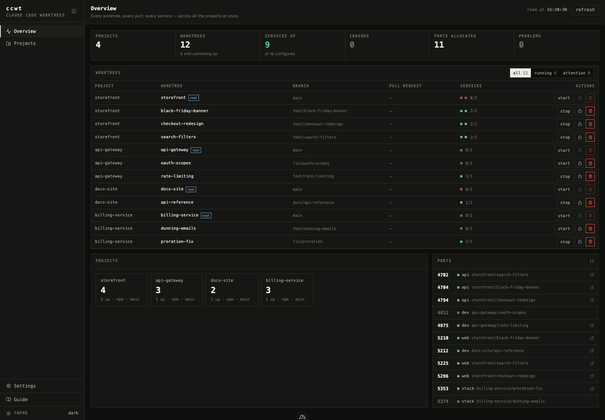
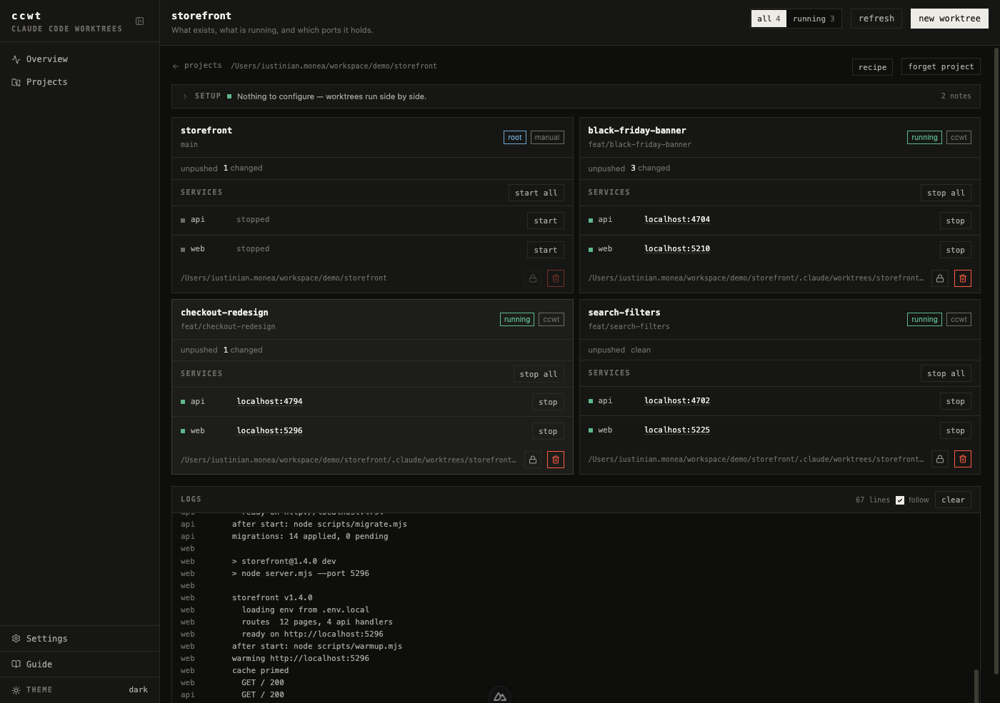
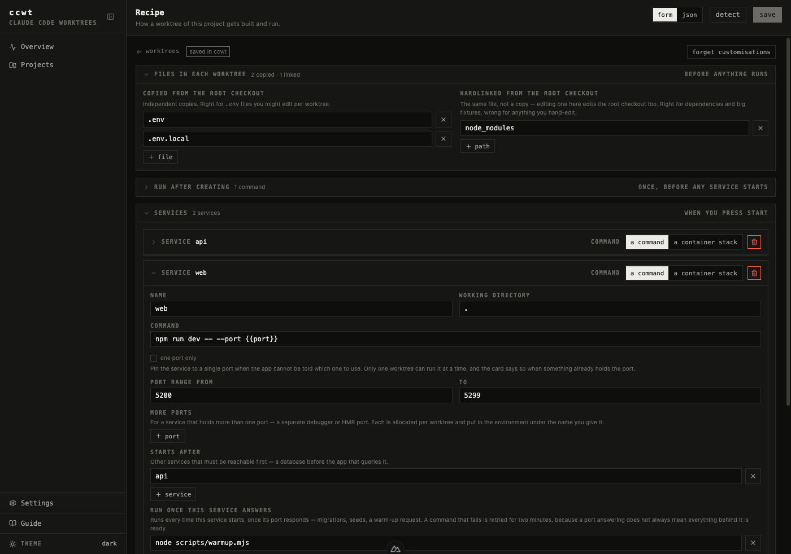
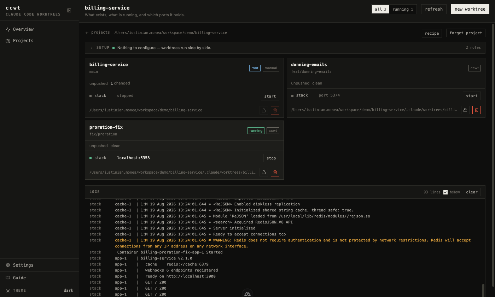
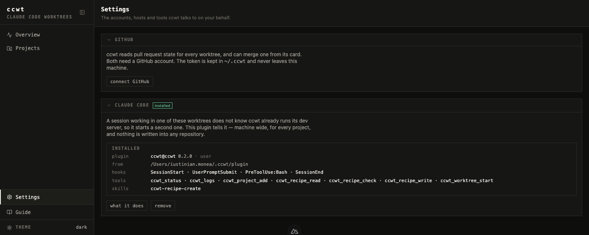

# ccwt

Run several branches at once. Every worktree gets its own dependencies, its own ports, its own dev
server and its own logs — from one local dashboard.



## Why

`git worktree add` gives you tracked files. Nothing else.

- No `node_modules`, no `.env`
- The port is already taken by the checkout next door
- `git worktree remove` refuses — untracked files are in the way

So every branch means installing again, copying secrets again, hunting for a free port, and cleaning
up by hand. **ccwt does that part.**

## Start

Needs git 2.20+ and Node 24+.

```bash
npm install
npm run build
npm start          # opens http://127.0.0.1:4600
```

1. **Register project** — point it at a repository. ccwt reads it and fills in the setup.
2. **New worktree** — a name is enough; its services can start as soon as it's ready.
3. Click its port. Work.
4. **Remove** it when you're done. The branch stays.

Nothing is added to your project. No file to commit, no script to change.

## Tour

Three copies of one project, each on its own ports, logs streaming into one panel.



What to copy, what to hardlink, what to run, what your services are. Detected when you register the
project; corrected here. `node_modules` is hardlinked — milliseconds, no extra disk.



A service is a command or a container stack. Each worktree gets its own compose project and ports.



## Pull requests

Optional. Sign in to GitHub once — a device code, the token stays in `~/.ccwt`, sign out is one click.

- **Every worktree card shows its branch's pull request** — open, draft, merged or closed.
- **Merge from the dashboard**, by merge, squash or rebase, with GitHub's own mergeability reason
  shown first and the account doing it named.
- **A merged pull request marks the worktree finished**, so you can see what's safe to delete.
- **It only touches the remote.** Nothing local is stopped, moved or deleted.

## Claude Code

Optional. One button in Settings installs the plugin into Claude Code's own storage, machine-wide for
every project. Nothing is written into any repository.

A session can then set a project up and run it *through* ccwt instead of around it.



**Seven MCP tools.** Three read:

| Tool | Returns |
|---|---|
| `ccwt_status` | Every worktree, its services, the port each holds and whether that port answers. Works with the dashboard closed. |
| `ccwt_logs` | A service's recent output, so a change can be checked without starting or building anything. |
| `ccwt_recipe_read` | The recipe, where it came from — ccwt's own storage, a committed `ccwt.config.json`, or nothing but detection — and whether it has gone stale. |

Four act:

| Tool | Does |
|---|---|
| `ccwt_project_add` | Registers the repository so it can hold a recipe and get worktrees. Writes nothing into it. |
| `ccwt_recipe_check` | Validates a candidate recipe without storing it — schema errors with the path of each, plus notes on what will parse but misbehave. |
| `ccwt_recipe_write` | Stores a recipe, validated first, so the saved one never passes through a broken state. Overwriting one already stored needs `replace`. |
| `ccwt_worktree_start` | Starts the services the recipe declares. ccwt still allocates the port, repairs what's missing and owns the process. |

**Starting is the only lifecycle verb an agent gets** — stopping and restarting stay in the dashboard.
No tool writes a file into your repository.

**Four hooks:**

- `SessionStart` — the session is told what ccwt runs, and named after its worktree (never over a
  title you typed).
- `UserPromptSubmit` — told again when something moves.
- `PreToolUse:Bash` — **a command that would start a dev server ccwt already has listening is denied**,
  and the refusal names the URL to open instead.
- `SessionEnd` — the marker is cleared.

**And one skill:** `ccwt-recipe-create`, so "set this project up for ccwt" is a request a session can
carry out — write the recipe, check it, store it — instead of you filling in the form.

## Good to know

- **Ports reach your app through the environment** — `PORT`, plus `CCWT_PORT_<SERVICE>` and
  `CCWT_URL_<SERVICE>` so services can find each other. Nothing to import.
- **A worktree keeps its port.** If something else takes it, the card says so and the next start moves.
- **Removal names the path first**, keeps your branch unless you tick the box, and won't delete a
  worktree you made yourself if it has anything to lose.
- **Local only** — binds `127.0.0.1`, new token every run, nothing leaves your machine.

## Hardcoded addresses

If a file has another service's address written in as a literal, every worktree points at the same
place. ccwt names the file and line, and keeps working — run one worktree of that project at a time,
or make the address configurable:

```diff
- '/api': 'http://127.0.0.1:4599',
+ '/api': process.env.CCWT_URL_API ?? 'http://127.0.0.1:4599',
```

## Not yet

- Service detection is Node-shaped — other stacks register and provision fine, but you write the run
  command yourself.
- No `.env` comparison between a worktree and the root checkout.

## License

[AGPL-3.0-only](LICENSE). Copyright © 2026 Iustinian Monea.

Free to use, study, modify and share, including at work — your worktrees, code and recipes stay
yours. Redistribute ccwt or run a modified copy as a network service, and you owe your users the
source under this same license.

---

"Claude" and "Claude Code" are Anthropic trademarks.
